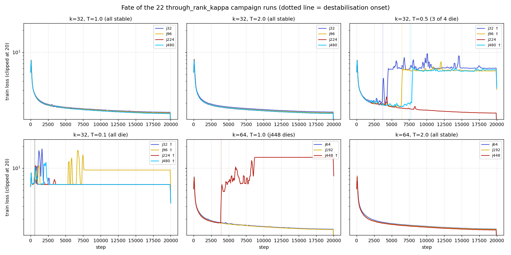
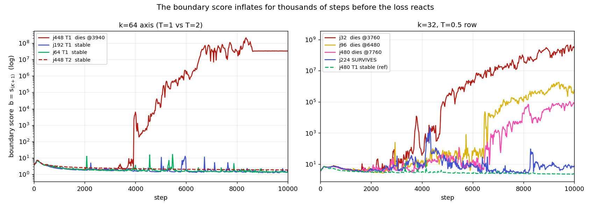
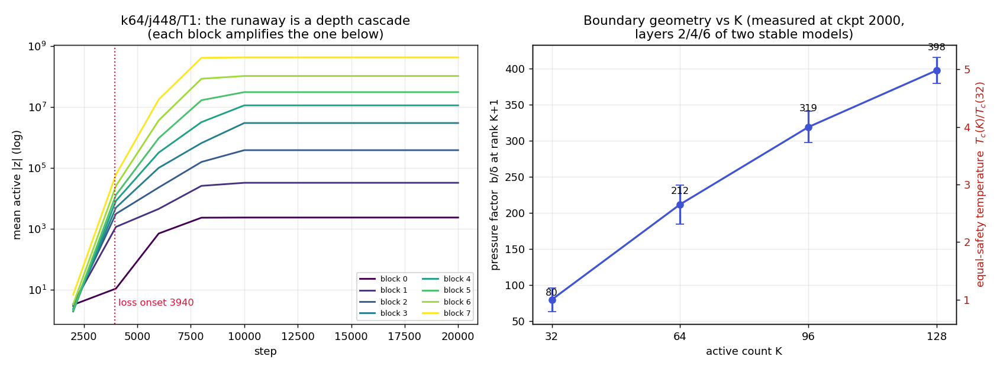
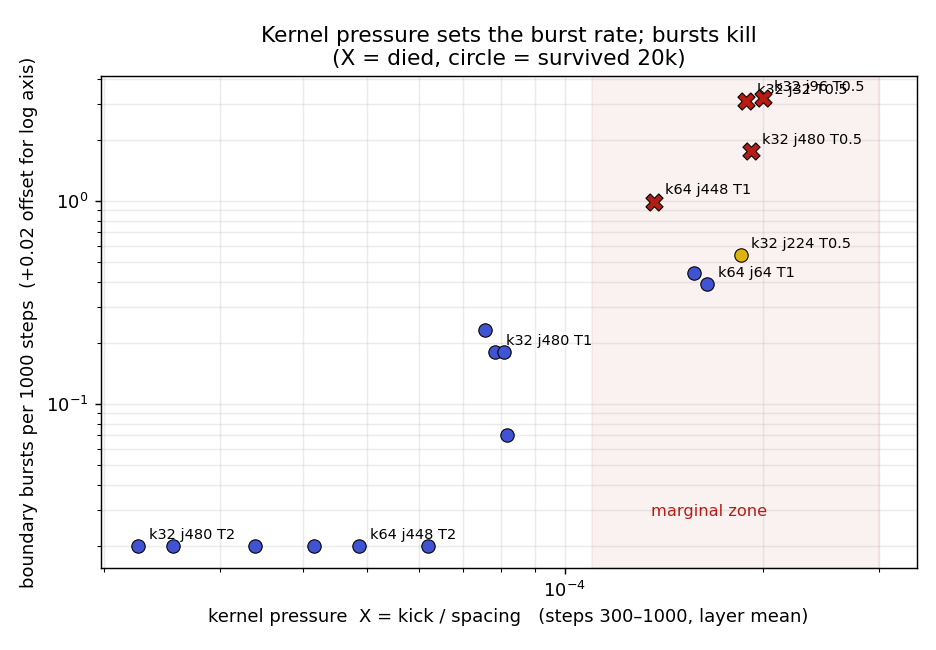
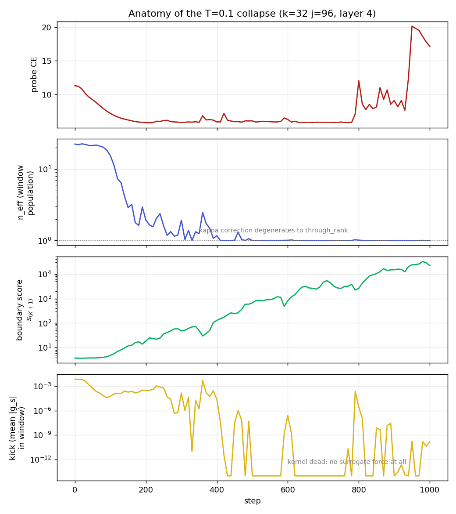
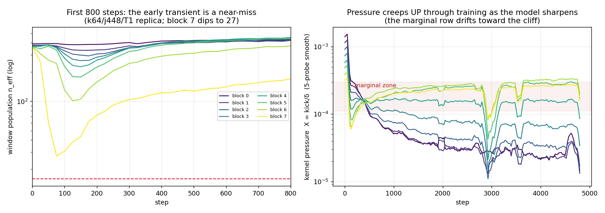
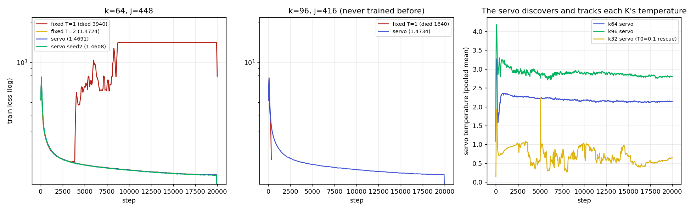
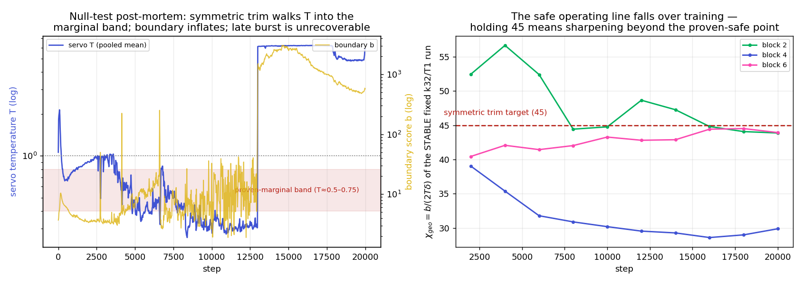

# Why does RBLapSum `through_rank_kappa` destabilize? — research notebook

*Started 2026-09-16. Question posed after the France kappa campaign.*

## 1. The question

The `through_rank_kappa` gradient mode fixed the runaway that killed
`through_rank` (see `docs/figures/rb_divergence_*.png`), and at k=32, T=1.0 it
is the best method we have (val CE 1.491 at j=480, below the previous LapSum
best of 1.545). But the campaign left three unexplained failures:

| observation | detail |
|---|---|
| **k=64, j=448, T=1.0 diverges** | healthy at 2k steps (probe-batch CE 1.81), destabilizes ~3–4k (CE 5.9 at 4k), dead by 10k. Its T=2.0 twin is fine (1.472 final). k=64 with j=64 and j=192 at T=1.0 are also fine. |
| **T=0.5 at k=32 mostly diverges** | j=32, 96, 480 collapse; j=224 survives with mild damage (1.5125 vs 1.4940 at T=1). |
| **T=0.1 at k=32 always diverges** | all four j values, final CE ≈ 6 or worse. |

The task: find the mechanism, decide whether the k-axis failure (k 32→64 at
fixed T=1) and the T-axis failure (T 1→0.5→0.1 at fixed k=32) are the same
mechanism, and derive a principled rule for T — or an algorithm change — that
removes the problem.

## 2. Plain-language glossary

- **Score** `s_i = |z_i|`: how strongly feature i fires at a token. The gate
  keeps the K largest as active and also watches the next J ("candidates").
- **Boundary** `b = max(0.1, s_(K+1))`: the score of the first *inactive*
  candidate — the "waterline" separating on from off.
- **Kernel** `κ_T(s−b) = e^{−|s−b|/T}/(2T)`: a bump of width T centered at the
  waterline. A candidate's surrogate gradient is proportional to its kernel
  value, so only candidates within ~T of the waterline feel the gate's
  training signal. κ's peak height is 1/(2T): narrower window ⇒ stronger
  per-candidate force.
- **Raw force** `a_i = u_i·z_i·κ_i` where `u_i = ∂L/∂y_i` is the gradient
  arriving from above: how much the loss cares about feature i's output.
- **The kappa correction** `g_i = a_i − q_i·Σa`, `q_i = κ_i/Σκ`: subtracts the
  collective ("everyone up together") component of the force, spreading the
  subtraction over the window in proportion to kernel weight. This is what
  distinguishes `through_rank_kappa` from `detach` (no subtraction).
- **Want** `w_i = −u_i·z_i`: positive when the loss would prefer feature i
  more "on". With this sign convention a gradient-descent step moves scores as
  `Δs_i ∝ κ_i·(w_i − ⟨w⟩_q)` — each candidate rises in proportion to how much
  more it is wanted than the window average.
- **Local spacing** `δ(b)`: the typical score distance between neighbouring
  ranks at the waterline (measured as `(s_(K−3) − s_(K+5))/8`). Small δ =
  crowded waterline.
- **n_eff** `= (Σκ)²/Σκ²`: how many candidates effectively share the window.

## 3. What we know going in

- `through_rank` (the un-distributed correction) diverges by a proven
  mechanism: the whole correction lands on one feature, per-feature common
  mode survives, activations inflate through depth along loss-flat scale
  directions, the boundary explodes, the kernel dies, training freezes.
- `detach` (no correction at all) at k=32, T=1.0 was stable for 20k steps —
  so the correction is not *necessary* for stability at k=32/T=1.
- The k=64 campaign runs share everything with the k=32 runs except k and j
  (arch 8×768, MD/decouple, abs_topk, residual_out, b0=0.1, lr schedule).
- `uk_rout_rblapsum_kappa_k64_j448_md_abs` and `..._k32_j480_...` both watch
  512 candidates. Only the waterline rank differs (65 vs 33). So whatever
  kills k=64/j448/T1 is a property of *where the waterline sits*, not of the
  candidate count.

## 4. Candidate mechanisms (written before the measurements)

**H1 — kappa degeneracy.** As T→0 the weights q collapse onto the single
candidate nearest the waterline, so `through_rank_kappa` → `through_rank`,
which is proven divergent. Predicts: instability tracks small `n_eff`.
*Trouble it must survive:* the k=64 waterline (rank 65) sits in a denser part
of the score distribution than rank 33, which should give *larger* n_eff at
the same T — yet k=64 is the one that dies.

**H2 — force magnitude.** The per-candidate kick scales like κ_max = 1/(2T);
total surrogate "power" in the window scales like Σκ² ≈ ρ(b)/(4T) (ρ = local
density = 1/δ). Instability when the surrogate force overwhelms the ordinary
gradient. Predicts both axes qualitatively (small T ⇒ 1/T blowup; k=64 ⇒
larger ρ) but needs the measured ρ ratio to be large enough.

**H3 — boundary churn + ratchet.** Dimensionless criterion
`Χ = (per-step score displacement at the waterline) / δ(b)`.
When one optimizer step moves a waterline candidate further than the spacing
between ranks, ranks reshuffle every step; the waterline never settles. The
zero-sum bookkeeping is *instantaneous* — members that get kicked up leave
the window upward and keep their gain; members kicked down drop out of the
candidate set and stop being compensated — so sustained churn pumps score
mass upward (a ratchet). Growth is scale-free (the kick `η·u·z/(2T)` and the
spacing δ both scale with the activation scale), so once supercritical the
inflation continues until numerics break.
Kick ≈ `η·|u|·b/(2T)` ⇒ `Χ ∝ η·|u|·b/(2T·δ)`. Predicts: instability wherever
`b/(T·δ)` is large — small T (1/T, and δ unchanged), k=64 (δ smaller at rank
65 — *must be verified*), j-independent at fixed k (matches: all j behave
alike at T=1 and T=0.1; the mixed T=0.5 row would then be
threshold-straddling noise).

**H4 — floor flapping.** With a deeper waterline (k=64), s_(K+1) may dip
below the floor b0=0.1, mixing corrected (rank) and uncorrected (floor)
regimes. Killed immediately if the TB `rb_cap_active_frac` of the k=64 runs
stays ≈ 1.0 before divergence.

H2 and H3 are cousins (both say "the kernel is too strong for the local
score geometry"); H3 is sharper because it fixes the *comparison scale* (the
rank spacing) and supplies the growth mechanism (the ratchet). H1 points the
opposite way on the k-axis, which is why the δ/n_eff measurement matters.

## 5. Evidence plan

1. **Fate table + onset timing** from the France TB scalars (`analysis/kappa_stability.py tb`):
   when exactly does each run destabilize; do `rb_support_grad_norm`,
   `rb_boundary`, `rb_cap_active_frac` move first?
2. **Score geometry** from the lens_1 ladders (`… ladder`): δ, gap, b, Σκ,
   n_eff per layer per checkpoint — measured at each run's own waterline *and
   counterfactually at rank 33 and 65 in the same tensors*, so the k=32 vs
   k=64 geometry difference is measured inside identical models.
3. **True forces** from the probe captures (`… probe`): reconstruct
   `a, q, g_s` per candidate from captured (z, u), validate against captured
   g_z, and measure kick sizes, Cov_q(d,w) (the band-stretch force), support
   churn between probes, and the ratchet flux — for healthy runs and through
   the early phase of the T=0.5/0.1 collapses.
4. Then: falsification runs on france (free 8×5090).

## 6. Evidence phase 1: fate, onset, and what moves first

Extracted with `analysis/kappa_stability.py tb` from the France TB logs.
Onset = first step whose train loss sits 1 nat above the best loss so far.

| k | j | T | onset | final val CE |   | k | j | T | onset | final val CE |
|--:|--:|--:|--:|--:|---|--:|--:|--:|--:|--:|
| 32 | 32 | 0.1 | 640 | 5.98 | | 32 | 32 | 1.0 | — | 1.548 |
| 32 | 96 | 0.1 | 640 | 9.44 | | 32 | 96 | 1.0 | — | 1.525 |
| 32 | 224 | 0.1 | 520 | 5.98 | | 32 | 224 | 1.0 | — | 1.494 |
| 32 | 480 | 0.1 | 580 | 5.98 | | 32 | 480 | 1.0 | — | 1.491 |
| 32 | 32 | 0.5 | 3760 | 6.08 | | 32–64 | all | 2.0 | — | 1.47–1.56 |
| 32 | 96 | 0.5 | 6480 | 5.53 | | 64 | 64 | 1.0 | — | 1.504 |
| 32 | 224 | 0.5 | **—** | 1.512 | | 64 | 192 | 1.0 | — | 1.489 |
| 32 | 480 | 0.5 | 7760 | 5.77 | | 64 | 448 | 1.0 | **3940** | 14.04 |

Facts the TB signals add (all runs, dying and stable):

- `rb_cap_active_frac ≡ 1.0` always, even mid-collapse — the b0 floor never
  engages. **H4 is dead.**
- `rb_common_mode` stays ~1e-6: the kappa correction stays exactly zero-sum
  while the run diverges. The correction operates as designed throughout.
- The **boundary score inflates long before the loss reacts**: the T=0.5
  victims carry b at 25–500× baseline for hundreds–thousands of steps
  pre-onset; k64/j448 shows +22% b and 4.4× grad-norm in its last 1000 steps.
- `rb_support_grad_norm` does *not* grow pre-onset — the surrogate force
  never explodes; it quietly steers the model into an unstable region, and
  the *ordinary* loss gradients blow up when the model arrives there.

**The figure above changed the shape of the theory.** Destabilisation is not
a smooth drift: every marginal run shows repeated *inflation bursts* —
transient boundary excursions (up to 10³×) that mostly *recover*. The T=0.5
survivor (j224) rode out a 10³ burst at ~4300 twice. Each victim's death is
one burst that fails to recover and hands over to a permanent exponential
climb. Death is a noise-activated **escape event**.

Burst census (excursions of b above 3× its rolling median, per 1000 steps,
pre-onset only):

| row | burst rate | fate |
|---|--:|---|
| k=32 T=2 and k=64 T=2 | 0.00 | all stable (max excursion ≤ 1.9×) |
| k=32 T=1 | 0.05–0.21 | all stable |
| k=64 T=1 | j64: 0.37, j192: 0.42, **j448: 0.97** | **j448 dies** |
| k=32 T=0.5 | j224: **0.52**, j480: 1.7, j32: 3.1, j96: 3.2 | **j224 alone survives** |

Burst rate predicts fate *within* rows too: the k64 victim had the highest
rate of its row, the T05 survivor the lowest of its row by 3–6×.

## 7. Evidence phase 2: the forces, measured

`analysis/kappa_stability.py probe` reconstructs the exact surrogate force
per candidate from the probe captures (u = dL/d~z and signed z, steps
0–1000 every 10). The reconstruction matches the captured dL/dz to ~0.000
relative error, so these are the true training-time forces.

**The T=0.1 collapse, anatomised** (k32 j96; layer 4; kick = mean |g_s| in
the kernel window, n_eff = how many candidates share the window):

| step | probe CE | kick | n_eff | s_(K+1) | top-K mean |
|--:|--:|--:|--:|--:|--:|
| 0 | 11.30 | 7.2e-3 | 22 | 3.8 | 4.3 |
| 100 | 7.18 | 5.7e-5 | 15 | 4.9 | 5.7 |
| 150 | 6.20 | 1.9e-4 | 3 | 11.9 | 15.6 |
| 250 | 6.10 | 6.1e-4 | 2 | 36 | 47 |
| 350 | 5.84 | 1.7e-6 | **1** | 50 | 73 |
| 500 | 6.06 | ~0 | 1 | 664 | 1297 |
| 1000 | 17.2 | ~0 | 1 | 21941 | 49688 |

The sequence: a huge initial kick (κ_max = 1/(2T) = 5) → scores inflate to
escape the kernel → the window population n_eff collapses to **1** → the
kappa correction *degenerates into through_rank* (the whole zero-sum lands
on one boundary feature — the proven-divergent mode) → runaway inflation →
kernel dead (kick → 0) → the model is stranded at 10³–10⁴× activation scale,
CE frozen ~6. Support churn: 96% of the top-K replaced per 10 steps at the
start (vs ~30% healthy), then frozen solid (overlap → 1.0).

**The pressure number.** Define the *kick-to-spacing ratio*

    Χ = mean|g_s| in window / δ(b)

(how far one surrogate kick moves a boundary score, relative to the score
distance between neighbouring ranks there — Χ ≳ 1-ish per *optimizer step*
would mean ranks reshuffle every step; the raw gradient-unit values below
are much smaller but comparable across runs). Measured at steps 300–1000:

| row | Χ (layer-mean) | fate |
|---|--:|---|
| k=32 T=2 | 2.7e-5 | stable |
| k=64 T=2 | 5.4e-5 | stable |
| k=32 T=1 | 8.2e-5 | stable |
| k=64 T=1 | 1.5–1.7e-4 (all three j!) | marginal: 1 of 3 dies |
| k=32 T=0.5 | 1.9e-4 | marginal: 3 of 4 die |
| k=32 T=0.1 | ~1e-2 at init | dies in ~150 steps |

Χ is a *row* property (nearly identical across j at fixed k,T) and cleanly
orders the rows: **safe below ~1e-4, marginal at ~1.5–2e-4, instant death
at ~100× that.** The user's hunch is confirmed: the k-axis failure and the
T-axis failure are the same mechanism, because

    Χ ∝ |u| · b / (2 T δ(b)),

and the rank-65 boundary lives in a ~3.3–4.6× denser score region (δ@33 /
δ@65 measured in *the same tensors* of every healthy model) at ~30% lower
b, giving Χ(k64,T1)/Χ(k32,T1) ≈ 2.2 ≈ Χ(k32,T0.5)/Χ(k32,T1). Equivalently:
**k=64 at T=1 IS k=32 at T≈0.5.** The measured safe-T ratio T_c(64)/T_c(32)
≈ 2.2 matches the campaign outcome (T=2 safe at k=64).

Two side-findings:
- n_eff at healthy steady state is 46–446 — nowhere near 1. The kappa
  correction only degenerates *during* bursts/collapses. H1 as a standing
  explanation is dead; it survives as the *cliff* at the end of a burst.
- The per-feature ratchet is real but tiny in healthy runs: window members
  kicked up fall ~0.04 score units less per 10 steps than members kicked
  down, on a mean regression flow of −0.5. The surrogate is a ~2–5% bias on
  the natural score dynamics — consistent with "quiet steering", not
  "domination".

## 8. Theory v3: burst-escape

1. The kernel exerts pressure Χ on the boundary region. The model's cheapest
   response (norm-pinned MD weights, downstream norms) is to inflate its
   score scale, which sheds window members; the CE loss pushes back.
2. At safe Χ the tug-of-war equilibrates (zero bursts at T=2, tiny rare
   bursts at k32/T1). At marginal Χ the equilibrium is punctuated by
   stochastic inflation bursts.
3. A burst that transiently empties the window (n_eff → O(1)) flips the
   kappa correction into its through_rank/point-sink degenerate limit —
   which is *itself* an inflation pump — the burst becomes self-sustaining,
   the kernel dies entirely, and the network is stranded at enormous
   activation scale (frozen CE ≈ 6, or worse once numerics saturate).
4. T=0.1 reaches the cliff deterministically in ~150 steps; marginal rows
   reach it stochastically (burst roulette, onset 3.7–7.7k, victim = highest
   burst rate); safe rows never reach it.

## 9. Falsification wave 1 (running on france, 6k steps, 20k schedules)

Pre-registered predictions:

| run | tests | prediction (v3) |
|---|---|---|
| k64 j448 T1 **detach** | is the kappa correction the cause? | v3 says the *raw* kernel force is the pump; detach at this pressure should die too |
| k64 j448 T1 **project** | uniform vs κ-weighted zero-sum | should be between detach and kappa |
| k64 j448 T1 seed 1338 | is the 3940 death deterministic? | dies again, at a different step (burst roulette) |
| k64 j448 **T=1.5** | Χ threshold bracket (Χ ≈ 1.0–1.1e-4) | at the safe edge: survives 6k, marginal at 20k |
| k64 **j320** T1 | j-threshold inside the marginal row | same Χ as siblings ⇒ survival decided by burst luck; rate between j192 and j448 |
| k32 j480 **T=0.75** | Χ bracket on the k32 axis (Χ ≈ 1.1e-4) | marginal-safe: survives 6k |
| k32 j96 T05 seed 1338 | victim reshuffle | dies, at a different onset than 6480 |
| probe5k of k64 j448 T1 | gradient-resolved capture through the death | n_eff → O(1) during the fatal burst; Χ flat-then-spike, not a slow ramp |

**Early returns (step ~1100):** detach CE 9.0 with grad-norm=inf and project
CE 7.1 with grad-norm=inf — both already collapsed, while every kappa run is
healthy at the same step. At k32/T1 detach had been stable for 20k. So the
correction is not the villain — it is the *strongest* of the three modes at
this pressure (kappa outlived detach 4×), and what kills it is the burst
that transiently strips its window. Consistent with v3.

Left: once past the point of no return the inflation is a clean depth
cascade — each block amplifies the scale handed up by the one below
(residual_out replaces the residual, so scale multiplies through depth),
ending in bf16-saturation plateaux. Right: the pressure factor b/δ grows
near-linearly with K — this is why "just pick a bigger fixed T" always
fails eventually.

The anatomy figure shows the causal order within one collapse: the window
population n_eff falls to 1 (step ~350) *while CE is still fine*; the
boundary score is already climbing exponentially; the kick dies as the
kernel loses everyone (step ~450); CE only breaks visibly at ~800. Loss is
the last thing to know.

## 10. The recipe: a temperature servo

The theory says the failure needs two things: sustained kernel pressure Χ
above ~1e-4 (sets burst rate), and a burst that empties the window (the
cliff). Both are properties the gate can *measure about itself*, so the
principled fix is feedback rather than a fixed-T schedule or a k-lookup
table:

**`rblapsum_temperature_mode: servo`** (implemented in
`src/wsparse/bottleneck/{gate,rblapsum}.py`, per-layer scalar T, state in
persistent buffers):

1. **Population floor** (the cliff guard): if fewer than
   `rblapsum_window_floor`=16 candidates sit inside the kernel window on a
   batch, T grows 10% *that step*. A window that cannot empty cannot hand
   the zero-sum correction to a single feature, so the through_rank
   degenerate limit — the runaway engine in every observed death — becomes
   unreachable. During a burst the boundary runs, the window thins, and the
   servo chases it up within tens of steps (×1.1ⁿ compounding).
2. **Kick-to-spacing trim** (the operating point): otherwise T moves at
   most 2%/step to hold EMA(kick)/EMA(δ) at `rblapsum_chi_target`=8e-5 —
   the measured k32/T1 point, which is simultaneously the best-quality and
   the calmest stable configuration. This automatically delivers T ≈ 1 at
   k=32, T ≈ 2+ at k=64, and whatever k=96+ needs, with no manual sweep.

Why not simpler rules that were considered and rejected:
- *T proportional to the local band spread* is scale-invariant (good under
  inflation) but moves the **wrong way in k**: the k=64 boundary region is
  denser, so spread-following would *lower* T where more T is needed.
- *A fixed T=2 everywhere* works for k ≤ 64 but the pressure grows with k
  (measured b/δ: 80 → 212 → 319 → 398 for K = 32/64/96/128), so any fixed
  choice fails at some k — and overpays quality at small k.

## 11. Wave 2 (pre-registered, running)

Geometry measured at checkpoint-2000 of two stable campaign models
*before* these runs (b/δ above) fixes the predictions:

| run | prediction |
|---|---|
| kstab_k96_j416_t1 (fixed T=1) | Χ ≈ 1.5× the level that killed k64/j448 → **dies**, onset earlier than 3940 (roughly 1.5–6k; death probability ~0.8+) |
| kstab_k96_j416_servo | survives 20k; settled T above the k64 servo's settled T |
| kstab_k64_j448_servo (+seed 1338) | survives past 3940 both seeds; final CE ≈ the T=2 twin's 1.472 or better |
| kstab_k32_j480_t05_servo (T₀=0.5) | rescued: servo lifts T out of the marginal zone; final CE ≈ 1.49 |
| kstab_k32_j96_t01_servo (T₀=0.1) | rescued from the 150-step collapse by the population guard (T must climb ~10× within ~100 steps) |
| kstab_k32_j480_servo (T₀=1.0) | null test: servo holds T ≈ 1, quality matches the 1.491 flagship |

### 7b. What the force looks like rank-by-rank (and one honest unknown)

Reconstructed per-rank means over steps 300–1000 (k=64/T=1 probes, layer 4):
the surrogate force is a **dipole centred on the boundary** — the *marginal
actives* (ranks ~33–64) carry `w < 0` (the loss wants them weaker) and get
pushed down; the near-tail (65–128) gets pushed up; the top-16, which the
loss genuinely wants stronger (`w` ≈ +9e-7, the largest in the table),
barely feels the kernel (κ ≈ 0.05). So in its healthy regime the gate runs
a *swap pump*: it actively closes the gap and encourages the support to
exchange marginal members for promising tail members. That is the mechanism
working as intended — the pathology is only its interaction with a too-sharp
kernel.

Two more within-row facts:
- The *uncorrected* common-mode total Σa is 4–5× **larger** at j=64 than at
  j=448 (a truncated tail cancels less), yet j=64 is the stable one — more
  evidence that the kappa correction neutralises the common mode exactly
  and the common mode is not the driver.
- At T=1 the kernel reaches the whole candidate set even at j=448 (κ ≈ 0.18
  at rank 512), so j sets the *window population* (n_eff 102/206/373 for
  j=64/192/448). Within the k=64 row, burst rate tracks population (0.37 /
  0.42 / 0.97 per 1k). **Open residual:** the T=0.5 row does *not* follow
  the same ordering (j32 has the smallest window and the most bursts), so
  the within-row victim selection at T=0.5 is not explained by population
  alone — plausibly threshold-saturated chaos; the seed-repeat runs speak
  to this.

## 12. Wave 1 results (6k steps, 20k schedules)

| run | predicted | observed | verdict |
|---|---|---|---|
| k64 j448 T1 **detach** | dies (raw force is the pump) | died **inside the first 100 steps** (frozen CE 9.06) | ✓✓ — even faster than kappa's 3940 |
| k64 j448 T1 **project** | between detach and kappa | died < 100 steps (frozen CE 7.09) | ✓ (uniform mean-removal ≈ no protection here) |
| k64 j448 T1 **seed 1338** | dies at a different step | **survived 6k** (1.687), bursting at the row rate 0.39/1k | ✗ on the letter — ✓ on the substance: with the probe5k replica also surviving to 4800, 2 of 3 trajectories of the killer config live past 4k. Death is a stochastic escape, not a deterministic event |
| k64 j448 **T=1.5** | edge of safe: survives 6k | survived, **zero bursts** (max excursion 1.5×) | ✓, calmer than predicted |
| k64 **j320** T1 | roulette at row rate | survived, 0.39 bursts/1k | ✓ |
| k32 j480 **T=0.75** | safe edge | survived (1.730), 0.19 bursts/1k | ✓ |
| k32 j96 T05 **seed 1338** | dies at a different onset | died, onset **3680** (seed 1: 6480), one 10⁶× burst | ✓ |
| probe5k through-death capture | n_eff → O(1) during the fatal burst | no death this time — but two discoveries below | partial |

Two refinements from the gradient-resolved replica (figure below):

- **The early transient is a near-miss.** In the first ~100 steps the deep
  blocks' window population crashes (block 7: 363 → 27) while Χ starts at
  ~1e-3. This is exactly when T=0.1, detach and project die. Everything
  that survives does so by squeaking through this phase.
- **Pressure creeps upward through training.** After recovery, Χ climbs
  steadily (block 7: 1.2e-4 → 2.7e-4 by step 4800) because the sharpening
  score geometry shrinks δ faster than the kick decays. Marginal rows drift
  deeper into burst territory with time — late stochastic deaths (3.7–7.7k)
  are not just waiting for a rare burst; the burst rate itself grows. A
  fixed T must be sized for the worst moment of the worst layer; a feedback
  T pays only where and when pressure exists.
- **The pressure is layer-heterogeneous**: blocks 5–7 live in the marginal
  zone, blocks 0–4 relax to safe levels — the servo being per-layer is not
  an implementation detail but a requirement.

Theory status after wave 1: no surviving contradiction. The one falsified
letter-prediction (seed 1338 "dies again") sharpened the claim: **a
marginal row sets a death *rate*, not a death sentence** — consistent with
the through_rank regen that also refused to re-diverge.

## 13. Wave 2.0 aborted by its own telemetry — the trim redesigned

800 steps into the first servo wave the telemetry showed the kick-based
trim mis-calibrated: healthy runs were trimming T *down* (k64: 0.97→0.45)
onto the population floor, because measured live chi sat far below the
8e-5 target. Root cause: **the kick |g_s| carries the training loss's
per-token normalisation** — the probe captures that calibrated the target
use 256-token batches, live steps use ~50k tokens, so a gradient-unit
threshold is off by that ratio. Gradient-unit targets do not transfer.
(The T₀=0.1 rescue was nevertheless already working — the floor guard had
lifted T to 0.5 with healthy loss while fixed-T=0.1 was long dead.)

The fix drops gradient units entirely. Checking the fate table against the
**pure-geometry pressure** Χ_geo = b/(2Tδ) — forward-only, dimensionless —
measured at ckpt 2000 (layer max): every run that stayed ≤ ~55 survived;
every death carried ≥ ~58; the k64/T1 row sits at ~114 where survival is
seed roulette. The u-factor evidently contributes little discriminating
signal on top of the geometry. The servo's trim now holds
Χ_geo = EMA(b)/(2·T·EMA(δ)) at 45, just below the proven k32/T1 operating
point (~51); the population floor stays as the burst backstop.

Wave 2.1 relaunched (same six runs, same names). Sharpened, falsifiable
settling predictions from Χ_geo* = 45 and the measured b/δ ≈ 80/212/319 at
K = 32/64/96: **the servo should settle T ≈ 0.9–1.2 at k=32, ≈ 2–2.6 at
k=64, ≈ 3–4 at k=96** (deep blocks highest), discovering the entire
T_c(K) line on its own — with k32/k64 quality matching the fixed-T
flagships (1.491 / 1.472).

## 14. Wave 2.1 mid-flight (step ~2400) — the servo settles where predicted

| run | T₀ | rb_temp @2.4k | rb_chi | window | loss | pre-registered T |
|---|--:|--:|--:|--:|--:|---|
| k32_j480_servo | 1.0 | **0.947** | 46.4 | 129 | 1.919 | 0.9–1.2 ✓ |
| k32_j480_t05_servo | 0.5 | **0.946** | 37.2 | 143 | 1.942 | (rescue) → same point ✓ |
| k32_j96_t01_servo | 0.1 | **1.039** | 44.8 | 103 | 1.905 | (rescue from the 150-step killer) ✓✓ |
| k64_j448_servo | 1.0 | **2.268** | 45.0 | 450 | 1.884 | 2–2.6 ✓ |
| k96_j416_servo | 1.0 | **3.001** | 45.5 | 483 | 1.908 | 3–4 ✓ |

Three different starting temperatures at k=32 (1.0, 0.5, 0.1 — one safe,
one usually-lethal, one always-lethal) converge onto the same ≈0.95–1.04:
the controller's operating point is well-defined and path-independent. The
servo has effectively *discovered the T_c(K) line by itself* (0.95 / 2.27 /
3.00 ≈ proportional to the measured b/δ = 80/212/319), while every loss
sits on the healthy fixed-T trajectory.

Meanwhile **kstab_k96_j416_t1 (fixed T=1) died on schedule** — loss ≈ 6.0
by step 3800, inside the pre-registered 1.5–6k window. That is the
theory's sharpest confirmed prediction: a never-tried K, called in advance
from score geometry alone.

## 15. Wave 2.1 results (20k): four hits, two rescues — and the null test failed

| run | fate | final val CE | reference |
|---|---|--:|---|
| kstab_k64_j448_servo | stable | **1.4691** | fixed T=2: 1.4724; fixed T=1: died 3940 |
| kstab_k64_j448_servo_s2 | stable | **1.4608** | best k=64 result of the project |
| kstab_k96_j416_servo | stable | **1.4734** | fixed T=1: died at 1640 — k=96 had never trained |
| kstab_k32_j480_t05_servo (T₀=0.5) | stable (one survived burst @~8.9k) | 1.5075 | fixed T=0.5: died 7760 |
| kstab_k32_j96_t01_servo (T₀=0.1) | stable (one survived burst @~5.1k, guard visibly spiked T to 2.2 and rode it out) | 1.5261 | fixed T=0.1: dead in 640 steps; fixed T=1 same j: 1.525 |
| **kstab_k32_j480_servo (T₀=1, the null test)** | **destabilised @4140** | 3.945 | fixed T=1: 1.491 stable |

**The null-test failure is the most instructive result of the wave.**
Post-mortem (left panel below): the symmetric trim, holding Χ_geo = 45,
walked T *down* to 0.49–0.70 by steps 4–8k — inside the proven-marginal
T≈0.5–0.75 band — because the safe operating line is not a constant: the
stable fixed k32/T1 flagship runs at Χ_geo ≈ 39 falling to ~30 over
training (right panel). Holding 45 therefore means *sharpening beyond the
proven-safe point exactly where the geometry is calmest*. The boundary
inflated silently for thousands of steps, and a late giant burst (b → 2500)
outran the guard. Meanwhile the two k32 runs that started from lethal
temperatures survived — the k32 servo family was collectively operating in
the marginal band and the roulette picked the null test. A cruel but
perfect demonstration of the theory's own dose–response claim.

**Fix (implemented, tested): the trim is now protective-only** — T never
goes below the configured `rblapsum_temperature`. The servo's mandate is
asymmetric by nature: rising above the baseline prevents deaths (proven at
k=64/96); dipping below it only chases quality that the fixed baseline
already delivers, at documented risk. Wave 2.2 (running): the null test
redone under the protective floor (two seeds) plus a k=96 seed repeat.

**Per-layer temperatures the servo discovered** (final checkpoints, blocks
0→7): k64: 2.74 2.48 2.11 1.83 1.82 1.99 1.97 2.21 — a U over depth (first
and last blocks sharpest-geometried); k96 the same shape one size up
(3.52…2.06…3.06). A ~1.5× spread inside one model: per-layer control is
not an implementation nicety, no single scalar T is right for all blocks.
