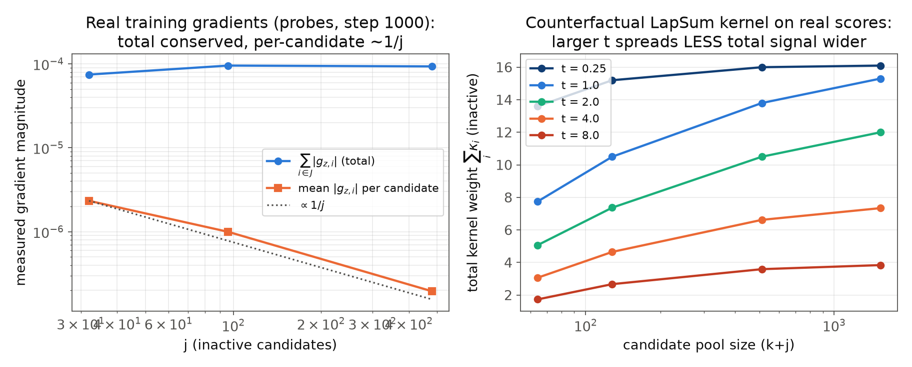
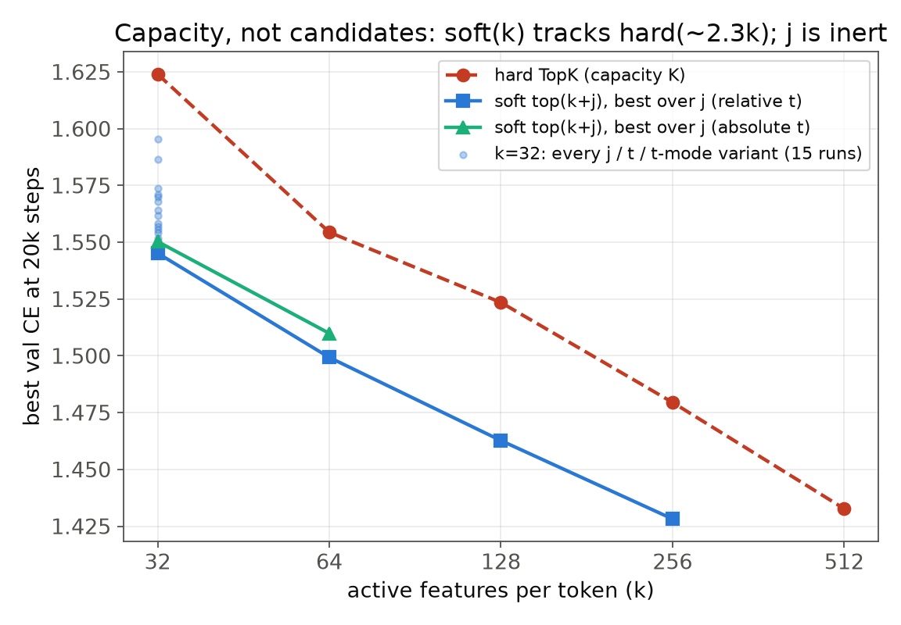

# Why j (and t) cannot buy what K buys

**Question.** `uk_rout_soft_k32_j32_md_abs` matches hard TopK at K=64, but raising
j (32 -> 480) or the absolute temperature (1 -> 4) does not improve it further --
the soft family never approaches hard TopK at larger K. Why, from first
principles? And if it is only bad hyperparameters, which are the good ones?

**TL;DR.** Soft top(k+j) *does* achieve hard-at-larger-K performance -- but only
by raising **k**. It can never get there through j or t, for three measured
reasons: (1) the forward pass is hard top-k *identically in j and t*, so those
knobs add zero capacity; (2) the backward selection signal is a *conserved
quantity* set by the score density at the boundary -- j and t only redistribute
it (thinner per candidate, and for large t, less faithful); (3) selection is not
even the binding constraint -- many disjoint k-supports are equally good, and
the smallest j already finds one. The scaling law across k = 32..256 is
**soft(k) ~ hard(2.3k)** at 20k steps (~5k-equivalent at step 5000, decaying
with budget: the surrogate is an early-training accelerator). Every
"better-hyperparameter" candidate was run and falsified at sigma = 0.003.

---

## 1. First principles: capacity vs. selection are different resources

The LapSum gate's output is `y = value * mask` with
`mask = hard_topk + s * (p - p.detach())`: the *forward value* is exactly the
hard top-k mask for every j and every t (the soft term is identically zero in
value). Therefore:

- **Capacity** -- how many features carry information through the bottleneck --
  is `k`, always. Hard TopK at 2K has twice the capacity; no (j, t) has more.
  CE is bounded below by the k-sparse floor of this architecture/data/budget.
- **Selection** -- *which* k features are active -- is all that j and t can
  influence, through the surrogate gradient on the candidate band.

So the only mechanism by which j could match hard-at-2K is by making selection
so much better that a k=32 code beats a 64-feature code. The measurements below
show selection saturates almost immediately, and its signal cannot be increased.

## 2. The selection signal is conserved (measured)

LapSum solves `sum_i p_i = k` with `p_i = F((r_i - b)/t)`; the per-candidate
gradient weight is the kernel `kappa_i = f((r_i - b)/t)/t`. Summed over a pool
that covers the kernel, `sum_i kappa_i -> integral f((r-b)/t)/t dN(r) ~ rho(b)`
-- the **score density at the boundary**, an intrinsic property of the score
distribution that neither j nor t controls.

Measured on real probe snapshots (step 1000, 1500 tokens; counterfactual solve
at each (t, pool)) and on real training gradients (right/left panels):

- **Real gradients**: total inactive-band `|g_z|` is *constant in j*
  (7.5e-5 / 9.6e-5 / 9.4e-5 at j = 32/96/480) while the per-candidate signal
  falls as 1/j (2.3e-6 -> 1.9e-7).
- **Temperature**: raising t widens coverage (N_eff 30 -> 1400 candidates) but
  *shrinks* the total (sum kappa 15.3 -> 3.8 from t=1 to t=8 at full pool), and
  the surrogate's soft mass goes nearly uniform -- at t=8, 30.7 of the 32 mass
  units sit on inactive candidates, so the gradient describes a near-uniform
  lottery, not the actual top-32 boundary. This is why t=4 did not help: more
  candidates *feel* gradient, but it is a smaller, less faithful total.
- At t=1, j=32 already gives N_eff ~ 30 effective candidates; larger j adds
  candidates the kernel has exponentially suppressed.

## 3. Selection is not the binding constraint (measured)

Same-seed probe runs differing only in j learn **near-disjoint supports**:
per-token IoU of top-32 sets between the j=32 and j=480 runs is 0.04-0.06 at
steps 500-1000 against 0.021 for random sets -- barely above chance, and not
increasing with training. If a privileged "best support" existed that larger j
approximates better, the runs would converge toward it (rising IoU) and larger
j would win (lower CE). Neither happens: CE is flat and supports are
uncorrelated. The k=32 solution space contains many equally good supports
(features are exchangeable), and the smallest band's conserved signal suffices
to settle into one.

## 4. The capacity scaling law

| k | soft(k), best over j (rel-t, 20k) | hard(K) reference | equivalent K |
|---|---|---|---|
| 32 | 1.545 | hard k64 = 1.554, k128 = 1.523 | ~75 |
| 64 | 1.499 | hard k128 = 1.523, k256 = 1.480 | ~170 |
| 128 | 1.463 | hard k256 = 1.480, k512 = 1.433 | ~300 |
| 256 | 1.428 | hard k512 = 1.433 | ~520 |

**soft(k) ~ hard(2.3k)**, uniformly over two octaves, while at every k the
whole j/t cloud collapses to one point (the k=32 cloud spans 15 runs across
j = 32..1504, t = 1..8, relative/absolute/annealed: 1.545-1.596). Two
corollaries:

- "soft k32 = hard k64" is not soft reaching up; it is the constant-multiplier
  law at its first octave. Scaling k moves soft *along* the hard capacity curve
  -- soft k256 (1.428) already beats hard k512 (1.433) with half the active
  features.
- The multiplier **shrinks with training budget**: at step 5000, soft k32
  (1.802) sits between hard k128 (1.824) and k256 (1.786) -- equivalent K ~ 180
  -- versus ~75 at 20k. The surrogate mostly *accelerates* selection learning;
  hard TopK's selection catches up (partially) given steps, capacity does not.

## 5. Falsification experiments (all at step 5000; seed sigma = 0.003)

| run | tests | prediction | val\@5000 | verdict |
|---|---|---|---|---|
| j32, seed 1 | run-to-run noise | -- | 1.805 (vs 1.802 seed 0) | sigma = 0.003 |
| j224, t anneal 4->0.05 | "wrong schedule" | ~family | 1.827 (vs 1.828 const-t) | no effect |
| j480, t=2 | coverage midpoint | ~family | 1.843 (vs 1.842 t=1) | no effect |
| j=1504 (full pool) | coverage extreme | ~family | 1.844 | no effect |
| j224, inactive_grad_scale=4 | breaks conservation | no gain / unstable | **5.98** | destructive |
| soft k128/k256/k512 abs t=1 | extend the law (abs) | track law | 6.0 / 7.76 / 7.0 | **collapsed** (below) |

- Every coverage/schedule variant lands within ~1 sigma of its constant-t
  sibling. There are **no better (j, t) hyperparameters at fixed k**.
- Amplifying the conserved signal x4 (`inactive_grad_scale`) does not add
  information -- it destabilizes, consistent with the swap_gibbs finding that
  amplification >= ~2.7x escapes the temperature brake.
- The mild *degradation* at large j is real (j480: +0.039 = 13 sigma over j32):
  the mass constraint leaks soft mass off the true support (at t1/j480, 43% of
  the 32 units sit on inactive candidates), diluting the active features'
  surrogate weighting.
- **Absolute t does not transfer across k**: at k >= 128 with t=1, the boundary
  sits in the bulk of the score distribution (huge rho(b)), the surrogate is
  order-of-magnitude misscaled, and training collapses outright (k256 frozen at
  val 7.7586 from step 1500). The healthy k-ladder is the relative-t family,
  whose t = sched x std(pool) tracks the boundary-local scale automatically.
  Comparing absolute-t across k requires retuning t per k.

## 6. Answers

1. **Why can't soft top(k+j) reach hard-at-larger-K by raising j or t?**
   Because j and t are backward-only knobs acting on a conserved selection
   signal (sum kappa -> rho(b)) toward a goal -- better selection -- that is
   already saturated at j ~ k, while the CE gap to hard-at-larger-K is a
   *forward capacity* gap that no backward knob can close. The k-sparse floor
   is reached by every variant; nothing at fixed k crosses it.
2. **Are there better hyperparameters?** Not in (j, t): 15+ runs spanning three
   orders of magnitude of coverage land within noise of one another or worse,
   and signal amplification destabilizes. The productive hyperparameter is
   **k**: soft(k) ~ hard(2.3k) at 20k steps, so the family scales exactly as
   hard does -- one octave ahead. Practical settings: j ~ k (more is mildly
   harmful), relative temperature (mandatory beyond k~64), constant schedule.
3. **What is the surrogate actually worth?** ~1.2 K-doublings of hard-TopK
   performance at 20k (more at short budgets), i.e. equal CE at ~2.3x fewer
   active features -- a capacity-efficiency multiplier, not a capacity source.

## Methods

20k finals from `summary.json` of the `uk_rout_*` families (`runs_uk`,
`runs_taiwan_2`); step-5000 comparisons from `metrics.jsonl` at matched
validation steps. Gradient/coverage measurements: `analysis/soft_j_mechanics.py`
over the `probe_uk_rout_soft_k32_j{32,96,480}_md_abs` early-training probes
(real scores and gradients, steps 0-1000), counterfactual LapSum solves via
`lapsum_barrier_sorted` at (t, pool) grids on the same scores. Falsification
wave trained on the 8-GPU box from `uk_rout_soft_k32_j32_md_abs`'s config with
single-field overrides, stopped after the step-5000 validation (max_steps
untouched -- schedules are defined over it). Figures:
`analysis/../docs/figures/inv_{scaling,conservation}.png`.
